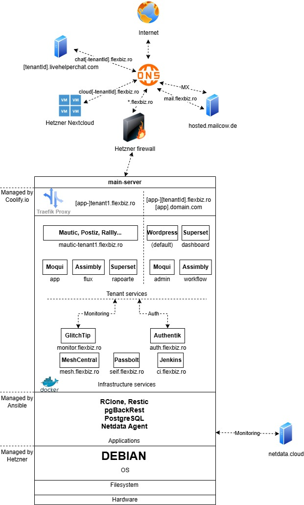

This the the source code for the infrastructure of the flexbiz.ro server.

The code is structured as follows:
- ansible: folder that contains the main ansible project for the server automation
- scripts: folder that contains scripts that are not automated with ansible or other one-time scripts; for scripts specific to a certain server, other than flexbiz.ro, create a subfolder with the company name and put the scripts there
- stacks: folder that contains the stacks that are deployed to the server(note: these are deployed using coolify); for stacks specific to a certain server, other than flexbiz.ro, create a subfolder with the company name and put the stacks there

# Documentation
## Infrastructure

## Default folder structure

### Database

- `/var/lib/pgbackrest` - postgresql database local backup location
- `s3:/pgbackrest/{{ inventory_hostname }}` - postgresql database remote backup location

### Data

- `/mnt` - mount path of Hetzner Storage Box
- `/data/{appName}` - application data, see details in the dedicated section below
- `/data/tenant/{tenantId}` - tenant data, see details in the dedicated section below
- `s3:/restic/{{ inventory_hostname }}` - remote backup of `/data` folder

Note: `{{ inventory_hostname }}` is the hostname as defined in hosts, eg. `main-server`

#### Application data

- `/data/{appName}`

Contains data specific to a certain application, eg. Moqui, Wordpress etc. 
Generally this would contain config files applicable to the whole application, not to a 
specific tenant, but it could also contain non critical data of the tenants(for example 
mysql database for shared apps).
For critical tenant data either store it in a Postgresql database per tenant, or flat files 
in `/data/tenant/{tenantId}`.

Examples:
- `/data/coolify` - coolify config data such as compose files and traefik proxy config

#### Tenant data

- `/data/tenant/{tenantId}/files` - special folder for storing tenant files that are not hosted in Nextcloud
- `/data/tenant/{tenantId}/{appName}` - application data specific to a certain tenant

Examples:
- `/data/tenant/flexbiz/wordpress` - wordpress site of flexbiz tenant