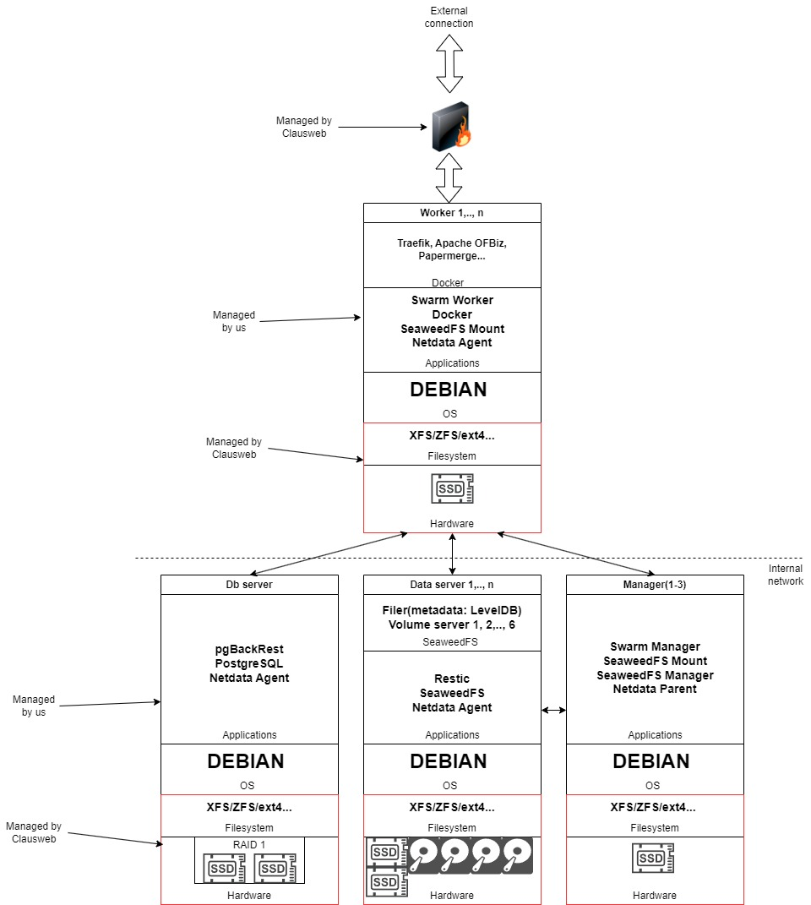

This the the source code for the infrastructure of the flexbiz.ro server.

The code is structured as follows:
- ansible: folder that contains the main ansible project for the server automation
- scripts: folder that contains scripts that are not automated with ansible or other one-time scripts; for scripts specific to a certain server, other than flexbiz.ro, create a subfolder with the company name and put the scripts there
- swarm-stacks: folder that contains the swarm stacks that need to run on the server; for stacks specific to a certain server, other than flexbiz.ro, create a subfolder with the company name and put the stacks there

# Documentation
## Infrastructure

- OS: Debian
- Automation: ansible
- Filesystem: xfs, zfs, ext4, ntfs(any of these should work)
- Firewall: ufw, fail2ban
- Distributed filesystem: seaweedfs
- Database: postgres
- Db backup: pgbackrest
- File backup: restic, rclone
- Containerization: docker
- Orchestration: docker swarm
- Client filesync: filestash
- Observability: netdata
- Landing pages/Blog: plone
- Web session recording: Hotjar
- Knowledge base: tawk.to
- ERP/CRM: Apache OFBiz
- Analytics: matomo

## Data server default mount structure

This serves as the central place about information regarding the standard structure of the folders that are mounted from the data servers.

- mount root path: `/mnt`
- `/mnt/letsencrypt` - storage of ssl certificates

### App data folders go in root path

- `/mnt/{appName}`

Examples:
- `/mnt/ofbiz` - config files, scripts etc.
- `/mnt/filestash` - config files

**IMPORTANT: ** currently `/mnt/filestash` is not used because filestash requires `filestash` user to have rw acces to 
this folder, for which `root` is the owner, so we get a permission error. UPDATE: `0777 /mnt/filestash` is used as a bind mount.

- `/mnt/portainer` - config, database files

### Tenant specific folders go in root path:

- `/mnt/{tenantId}/files` - special folder for storing tenant files, served through Filestash
- `/mnt/{tenantId}/{appName}`

Examples:
- `/mnt/flexbiz/ofbiz` - tenant specific Ofbiz resources